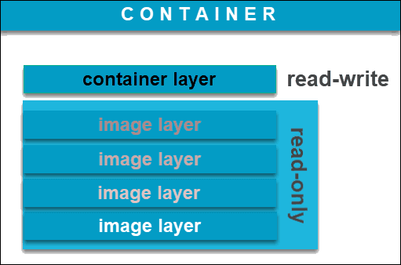

# 3-1 컨테이너 이미지 찾기 및 검사

# Container 와 Image

---



## Container Image

- Docker에서 컨테이너를 구동하기 위하여 사용하는 데이터
    - Container는 해당 이미지를 실행하는 Instance이다.
- Union File System을 활용한 계층 구조 사용
- 컨테이너 이미지는 애플리케이션을 지원하는 모든 파일이 포함된 단일 파일이며 애플리케이션이 포함되어 있다,

## Image Registry

### Container Image Registry

- 컨테이너 이미지 레지스트리는 컨테이너로 배포하는 이미지를 저장하는 레지스트리 서버
- 레지스트리는 컨테이너 이미지를 끌어오기(pull), 밀어넣기(push), 업데이트, 검색, 제거하는 메커니즘을 갖고 있다.

### Registry 종류

- `공개 레지스트리(Public Registry)` : 인증 없이 누구나 이미지를 사용할 수 있는 레지스트리입니다.
- `비공개 레지스트리(Private Registry)` : 특정 사용자만 사용할 수 있으며, 인증이 필요합니다. 일반적으로 사용자 이름과 비밀번호 또는 토큰이 필요합니다.
- `외부 레지스트리(External Registry)` : 조직 외부에 위치하거나 조직의 관리 및 제어 범위 밖에 있는 레지스트리를 의미합니다.
- `기업 레지스트리(Enterprise Registry)` : 조직이 관리하는 레지스트리 서버입니다. 여러 가지 기업용 레지스트리 설치 옵션에 대해 논의할 예정입니다.
- `OpenShift 내부 레지스트리` : OpenShift에는 기본적으로 내장된 레지스트리가 있습니다. 기본적으로 이 내부 레지스트리는 OpenShift 클러스터 내에서 소스-이미지 빌드 및 도커 빌드에 사용됩니다.

### **Red Hat 관리 레지스트리**

- Red Hat에서는 레지스트리로부터 제공되는 다양한 이미지 유형을 제공하며 공개 레지스트리와 비공개 레지스트리로 나뉜다.

| 컨테이너 레지스트리 | 설명 | 퍼블릭/프라이빗 | 인증 필요 | Red Hat 계정 필요 | 재배포 가능한 이미지 |
| --- | --- | --- | --- | --- | --- |
| registry.access.redhat.com | Red Hat 제품의 이미지를 호스팅합니다. 활성 Red Hat 제품 서브스크립션이 있어야 하며, 제품의 EUA를 준수해야 합니다. | 퍼블릭 | 아니오 | 예, 제품 서브스크립션 필요 | 일부만 가능, Red Hat Enterprise Linux UBI 기반 이미지 |
| registry.redhat.io | Red Hat 제품의 이미지를 호스팅합니다. Red Hat Customer Portal 자격 증명으로 인증해야 합니다. | 프라이빗 | 예 | 예 | 아니오 |
| registry.connect.redhat.com | 공인 파트너의 타사 제품 이미지를 호스팅합니다. Red Hat Customer Portal 자격 증명이 필요합니다. | 프라이빗 | 예 | 예 | 파트너의 재량에 따라 서브스크립션 또는 라이센스가 적용될 수 있음 |

## quay.io

- Red Hat이 소유하고 관리하는 레지스트리.
- quay.io를 통해 자신만의 비공개 기업 레지스트리를 생성할 수도 있습니다. 더불어, 기업용 레지스트리 소프트웨어에 대해 이야기할 때,
- quay 인스턴스를 OpenShift 내에 설치하는 것도 가능하다
- quay는 공개 레지스트리와 비공개 레지스트리 모두 가능
- Quay.io는 다음과 같은 고급 기능을 제공
    - 이러한 기능 중 일부는 빌드 트리거(소스 코드의 변경을 감지하고 자동으로 새 컨테이너 이미지를 빌드),
    - 보안 스캔(레지스트리에 저장된 컨테이너 이미지의 보안 취약점 검사),
    - 로봇 계정(자동화된 작업을 위한 인증) 등이 있습니다.

# **컨테이너 이미지 식별 정보**

---

[Red Hat Ecosystem Catalog](https://catalog.redhat.com/software/containers/ubi8/httpd-24/6065b844aee24f523c207943?container-tabs=gti&gti-tabs=unauthenticated)

```bash
oc import-image ubi8/httpd-24:1-274 --from=**registry.access.redhat.com/ubi8/httpd-24**:1-274 --confirm
```

### image 표기법

```bash
**<repository>/<user>/<image_name>:<tag> #**컨테이너 이미지를 식별하기 위한 표준 표기 방식
```

- **Registry**:
    - 컨테이너 이미지를 저장하고 공유하는 콘텐츠 서버.
    - 예: [registry.access.redhat.com](http://registry.access.redhat.com/)
    - 태그가 지정된 컨테이너 이미지를 포함하는 하나 이상의 리포지토리로 구성됩니다.
- **Name**:
    - 레지스트리 내의 컨테이너 이미지 리포지토리를 식별하는 문자열.
    - 문자, 숫자, 일부 특수 문자로 구성됩니다.
    - 예: `ubi8/httpd-24`는 `registry.access.redhat.com` 레지스트리의 리포지토리입니다.
        - Registry:registry.access.redhat.com
        - Repository:ubi8/httpd-24
- **ID(Image Digest)/Hash**:
    - SHA(Secure Hash Algorithm) 코드를 사용하여 이미지를 식별합니다.
    - 변경 불가능하며 항상 동일한 컨테이너 이미지 콘텐츠를 가리킵니다.
    - 예: `sha256:38427c29f25648e209504e7c92dd8781891dec20ab1f7cd417be6b647cb311eb`
- **Tag**:
    - 리포지토리의 컨테이너 이미지에 대한 레이블.
    - 버전 제어를 위해 다른 이미지와 구분됩니다.
    - 예: `1-274`은 `registry.access.redhat.com/ubi8/httpd-24` 이미지의 고정 태그입니다.

```bash
oc new-app httpd:2.4-el7
oc get pod
oc expose svc/httpd
oc get route

oc exec -it httpd-ex- /bin/bash

oc new-app httpd:2.4-el7~https://www.github.com/sclorg/httpd-ex.git
oc get pod
oc expose svc/httpd-ex
oc get route
```

# Container Image 구성요소

---

- **Layers**:
    - 컨테이너 이미지는 지침에서 생성됩니다.
    - 각 지침은 컨테이너 이미지에 계층을 추가합니다.
    - 각 계층은 해당 계층과 다음 계층 간의 차이점으로 구성됩니다.
- **Metadata**:
    - 컨테이너 이미지에 대한 지침과 설명서가 포함되어 있습니다.

## Layer

- 이미지를 빌드할 때는 Containerfile 내의 명령이 순서대로 실행되고 기본 이미지를 기반으로 적용된다.
- 컨테이너 파일의 각 줄은 순서대로 처리되어 레이어가 생성됨.
- 레이어링은 재사용성을 용이하게 하고, 저장 공간을 최적화하며, 시장 출시 시간을 단축하는 데 중요함.
- 장점
    - 기본 이미지 위에 추가로 빌드하여 사용자 정의 이미지를 생성함.
    - 저장 공간 소비를 줄이고 시장 출시 시간을 단축함.
    - 이미지 레지스트리에서 이미지를 획득할 때 누락된 레이어만 다운로드함.

## Container Image Metadata

```bash
cat Containerfile
```

```docker
# This is a comment line
2 FROM        registry.redhat.io/ubi8/ubi:8.6
3 LABEL       description="This is a custom httpd container image"
4 RUN         yum install -y httpd
5 EXPOSE      80
6 ENV         LogLevel "info"
7 ADD         http://someserver.com/filename.pdf /var/www/html
8 COPY        ./src/   /var/www/html/
9 USER        apache
10 ENTRYPOINT  ["/usr/sbin/httpd"] 
11 CMD         ["-D", "FOREGROUND"]
```

1. 해시 또는 파운드 기호(#)로 시작하는 줄은 주석입니다.
2. `FROM` 명령은 새 컨테이너 이미지가 registry.redhat.io/ubi8/ubi:8.6ubi8/ubi:8.6 컨테이너 기본 이미지를 확장함을 선언합니다.
3. `LABEL`은 이미지에 일반 메타데이터를 추가합니다.
4. `RUN`은 현재 이미지 맨 위의 새 계층에 있는 명령을 실행합니다. 명령을 실행하는 데 사용되는 쉘은 /bin/sh입니다.
5. `EXPOSE`는 컨테이너가 런타임에 지정된 네트워크 포트에서 수신함을 나타냅니다. EXPOSE 명령은 메타데이터만 정의합니다. 호스트에서 포트에 액세스하도록 설정할 수 없습니다.
6. `ENV`는 컨테이너에서 사용할 수 있는 환경 변수를 정의합니다.
7. `ADD` 명령은 로컬 또는 원격 소스에서 파일이나 폴더를 복사하여 컨테이너의 파일 시스템에 추가합니다.
8. `COPY`는 작업 디렉터리에서 파일을 복사하여 컨테이너의 파일 시스템에 추가합니다.
9. `USER`는 RUN, CMD, ENTRYPOINT 명령에 대해 컨테이너 이미지를 실행할 때 사용할 사용자 이름 또는 UID를 지정합니다.
10. `ENTRYPOINT`는 컨테이너에서 이미지가 실행될 때 실행할 기본 명령을 지정합니다.
11. `CMD`는 ENTRYPOINT 명령의 기본 인수를 제공합니다.

# Skopeo

- **개요**
    - Skopeo는 원격 컨테이너 이미지를 검사하고 관리하는 도구
    - 다양한 컨테이너 레지스트리 및 리포지토리에서 이미지를 복사 및 동기화 가능.
        - podman push 명령어와 비슷한 작업을 수행하지만, 추가적으로 이미지 복사, 이미지 삭제, 이미지 메타데이터 조회 등의 작업도 수행할 수 있다.
    - 데몬이 필요 없이 실행.
- **설치 및 실행**
    - skopeo는 skopeo 명령줄 유틸리티로 실행됩니다.
    - 다양한 패키지 관리자 (DNF, Brew, APT)로 설치 가능.
    - 일부 Linux 배포에 기본으로 설치되어 있을 수 있습니다.
        
        ```bash
        [user@host ~]$ sudo dnf -y install skopeo
        ```
        
    - Windows에서는 패키지 바이너리로 사용 불가.
    - 컨테이너 이미지로 사용할 때의 자세한 정보는 [Skopeo 리포지토리의 skopeoimage 개요 가이드](https://github.com/containers/skopeo/blob/main/contrib/skopeoimage/README.md) 참조.
    - 소스 코드에서 설치 및 빌드 방법은 [Skopeo 리포지토리의 설치 가이드](https://github.com/containers/skopeo/blob/main/install.md#container-images) 참조.
- **사용법**
    - skopeo는 컨테이너 이미지 및 레지스트리를 관리, 검사하는 명령 제공.
    - 인증이 필요한 레지스트리에서는 로그인 필요.
        
        ```bash
        [user@host ~]$ skopeo login quay.io
        ```
        
    - **주요 명령어**
        - `skopeo list-tags`: 사용 가능한 모든 태그 나열.
        - `skopeo inspect`: 이미지 이름에 대한 하위 수준 정보 조회.
        - `skopeo copy`: 이미지를 한 위치에서 다른 위치로 복사.
        - `skopeo delete`: 리포지토리에서 이미지 삭제.
        - `skopeo sync`: 위치 간 이미지 동기화.
        
        ```bash
        # 이미지 검사: 원격 레지스트리의 이미지 정보(레이어, 태그 등)를 조회할 수 있다.
        skopeo inspect **docker://docker.io**/library/busybox:latest
        
        # 이미지 복사: 레지스트리 간에 이미지를 복사할 수 있다. 이 기능은 이미지의 이동이나 백업을 위해 사용할 수 있다.
        skopeo copy **docker://docker.io**/library/busybox:latest **docker://quay.io**/myrepo/busybox:latest
        
        # 이미지 삭제: 특정 레지스트리에서 이미지를 삭제할 수 있습니다.
        skopeo delete **docker://quay.io**/myrepo/busybox:latest
        ```
        

# oc image 명령

OpenShift의 `oc image` 명령을 사용하면 컨테이너 이미지에 관한 정보를 검사, 구성 및 검색

- **oc image info**
    - 컨테이너 이미지의 정보를 검사 및 검색합니다.
    
    ```bash
    [user@host ~]$ oc image info registry.access.redhat.com/ubi9/httpd-24:1-233 --filter-by-os amd64
    
    ```
    
    - 주요 정보:
        - 이미지의 ID/해시 SHA
        - 이미지 계층
        - 환경 변수, 네트워크 포트, 명령 등의 메타데이터
- **oc image append**
    - 컨테이너 이미지에 계층을 추가하고 레지스트리로 내보낼 수 있습니다.
    
    ```bash
    [user@host ~]$ oc image append --from=[SOURCE_IMAGE] --to=[DEST_IMAGE] --layer=[LAYER_PATH]
    
    ```
    
- **oc image extract**
    - 컨테이너 이미지에서 로컬 디스크로 파일을 추출하거나 복사합니다.
    
    ```bash
    [user@host ~]$ oc image extract [IMAGE_NAME]:[TAG] --path /path/in/image:/path/on/host
    
    ```
    

- **oc image mirror**
    - 한 컨테이너 레지스트리에서 다른 컨테이너 레지스트리로 이미지를 미러링합니다.
    - 예) 퍼블릭 레지스트리와 프라이빗 레지스트리 사이에서 컨테이너 이미지를 미러링
    
    ```bash
    [user@host ~]$ oc image mirror [SOURCE_IMAGE]:[TAG] [DEST_REGISTRY]/[DEST_IMAGE]:[TAG]
    
    ```
    

# Rootless

- 일반 사용자로서 컨테이너를 실행할 때 발생하는 프라이빌리지(Privilege) 제한에 대한 개념
- 기본적으로 컨테이너는 독립된 환경을 제공하면서 호스트 시스템의 루트 권한을 제한하여 보안을 강화한다.
    - `subuid`와 `subgid`를 사용하여 일반 사용자로 컨테이너를 실행할 수 있다.
- Rootless 모드를 사용하면 일반 사용자로서 컨테이너를 실행할 수 있으며, **컨테이너 내에서는 루트 권한을 사용할 수 있지만 호스트 시스템에는 영향을 미치지 않는다.**

```bash
❯ podman run -it quay.io/apollo11plus/myhttpd:latest bash
[root@f65a1f2d9a98 /]# id
uid=0(root) gid=0(root) groups=0(root)

❯ podman run -it quay.io/apollo11plus/myhttpd:latest bash
bash-5.1$ id
uid=994(python-server) gid=994(python-server) groups=994(python-server)
```

- **참고 : Rootless 모드의 장점**
    1. 보안 향상: 컨테이너가 루트 권한을 가지지 않기 때문에, 악의적인 동작으로 인한 호스트 시스템 및 다른 컨테이너에 대한 위험을 줄일 수 있다.
    2. 호스트 시스템 분리: 컨테이너 실행 중에는 호스트 시스템의 루트 파일 시스템에 대한 액세스가 제한되므로, 호스트 시스템의 중요한 파일이나 디렉토리에 실수로 손상을 줄 가능성이 줄어듭니다.
    3. 멀티 유저 환경: 다중 사용자 시스템에서 여러 사용자가 동시에 컨테이너를 실행할 수 있습니다. 각 사용자는 자신의 컨테이너 내에서 자유롭게 작업할 수 있으며, 서로 간섭하지 않습니다.

```yaml

skopeo list-tags docker://registry.access.redhat.com/ubi9/httpd-24

#Skopeo inspect 명령을 통해 이미지 정보를 확인할 수 있다.
skopeo inspect --config docker://registry.access.redhat.com/ubi9/httpd-24

```