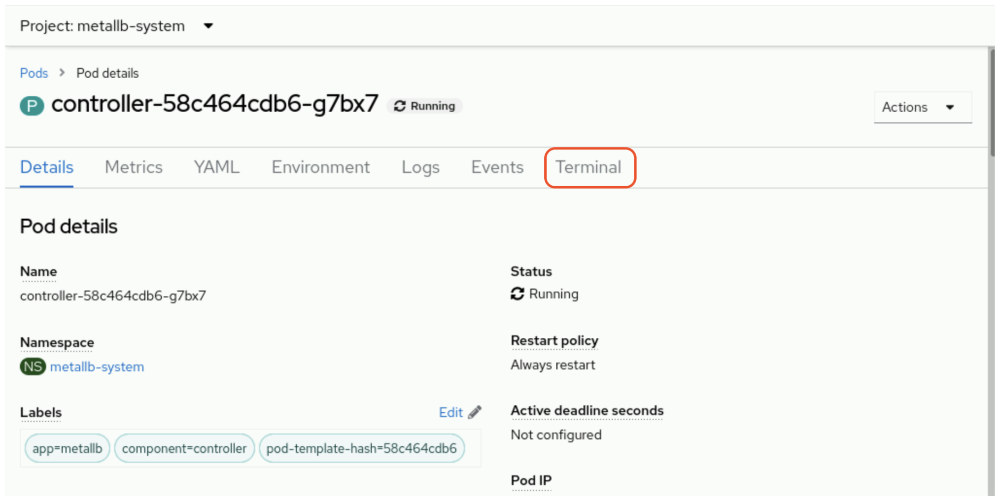

# 3-2 Container 및 Pod 문제 해결

# 컨테이너 및 파드의 문제 해결

# **목표**

- 컨테이너에서 추가 프로세스를 시작하고, 임시 파일 시스템을 변경하며, 단기 네트워크 터널을 열어 포드를 문제 해결합니다

# 개요

- **컨테이너의 특성**:
    - 컨테이너는 변경할 수 없고 일시적이다.
    - 변경 사항이 필요한 경우나 새 컨테이너 이미지가 필요한 경우, 실행 중인 컨테이너를 다시 배포해야 한다.
- **실행 중인 컨테이너의 업데이트를 통한 문제해결**
    - **빠른 피드백**: 실시간으로 문제를 해결하고 결과를 바로 확인할 수 있습니다.
    - **트러블슈팅 간소화**: 실행 환경에 대한 추가적인 설정이나 도구 없이 바로 문제점을 확인하고 수정할 수 있습니다.
    - **임시 해결책 제공**: 영구적인 수정을 위한 시간을 확보하면서 즉각적인 문제를 해결할 수 있습니다.
    - **문제의 원인 파악**: 실행 중인 환경에서의 문제를 직접 확인하면 문제의 원인을 정확하게 파악하기 쉽습니다.
- **문제 해결 절차**:
    1. **컨테이너 접속**: 실행 중인 컨테이너에 접속합니다 (예: **`docker exec -it [컨테이너 이름/ID] /bin/bash`**).
    2. **문제 파악**: 로그, 시스템 상태, 애플리케이션 상태 등을 확인하여 문제를 파악합니다.
    3. **소스코드 수정**: 문제가 발생하는 부분의 소스코드를 수정합니다.
    4. **변경 테스트**: 수정된 소스코드를 실행하여 문제가 해결되었는지 확인합니다.
    5. **외부 저장소에 반영**: 문제 해결이 확인되면 변경 사항을 외부의 소스 코드 저장소에 반영합니다.
    6. **새로운 컨테이너 이미지 빌드**: 수정된 소스코드를 기반으로 새로운 컨테이너 이미지를 빌드합니다.
    7. **컨테이너 재배포**: 빌드된 새로운 컨테이너 이미지를 기반으로 컨테이너를 재배포한다

# **CLI 문제 해결 툴**

- 관리자는 다양한 툴을 사용하여 실행 중인 컨테이너를 상호작용하고 검사하며 변경할 수 있습니다.
- **`oc get`** 등의 명령으로 지정된 리소스 유형의 세부 정보를 수집할 수 있습니다.
- 리소스를 자세히 검사하거나 실시간으로 업데이트하기 위한 다른 명령도 사용 가능합니다.
- oc 명령어를 사용하여 파드를 배포하고 관리할 수 있습니다. kubectl 명령어와 oc 명령어는 같은 파일을 사용하고 동일한 기능을 제한다.

### kubectl

- `kubectl` CLI는 다음 명령을 제공합니다.
    - `kubectl describe`: 리소스의 세부 정보를 표시합니다.
    - `kubectl edit`: 시스템 편집기를 사용하여 리소스 구성을 편집합니다.
    - `kubectl patch`: 리소스의 특정 속성 또는 필드를 업데이트합니다.
    - `kubectl replace`: 리소스의 새 인스턴스를 배포합니다.
    - `kubectl cp`: 컨테이너 간에 파일 및 디렉터리를 복사합니다.
    - `kubectl exec`: 지정된 컨테이너 내에서 명령을 실행합니다.

### OC

- `oc` CLI에는 이전 `kubectl` 명령이 지원될 뿐만 아니라 실행 중인 컨테이너의 검사 및 문제 해결을 위해 다음 명령이 추가되었습니다.
- `oc` CLI는 다음 명령을 제공합니다.
    - `oc status`: 선택한 네임스페이스의 컨테이너 상태를 표시합니다.
    - `oc explain`: 지정된 리소스에 대한 설명서를 표시합니다.
    - `oc rsync`: 컨테이너 간에 파일 및 디렉터리를 동기화합니다.
    - `oc rsh`: 지정된 컨테이너 내에서 원격 쉘을 시작합니다.
    - `oc port-forward`: 지정된 컨테이너에 대한 포트 전달자를 구성합니다.
    - `oc logs`: 지정된 컨테이너의 로그를 검색합니다.

# **리소스 편집 및 검사**

1. **Describe 명령**: 리소스의 세부 정보 확인
    
    ```bash
    [user@host ~]$ oc describe pod dns-default-lt13h
    ```
    
2. **Edit 명령**: 지정된 리소스의 편집
    
    ```bash
    [user@host ~]$ oc edit pod mongo-app-sw88b
    ```
    
3. **Patch 명령**: 리소스의 특정 필드 업데이트
    
    ```bash
    [user@host ~]$ oc patch pod valid-pod --type='json' -p='[{"op": "replace", "path": "/spec/containers/0/image", "value":"<http://registry.access.redhat.com/ubi8/httpd-24>"}]'
    ```
    

# **컨테이너 간 파일 복사**

1. **Copy 명령**: 파일 및 디렉터리 복사
    
    ```bash
    # 로컬 파일을 특정 컨테이너로 복사:
    oc cp <local_file_path> <namespace>/<pod_name>:<remote_file_path> -c <container_name>
    
    # 특정 컨테이너에서 로컬로 파일 복사
    oc cp <namespace>/<pod_name>:<remote_file_path> <local_file_path> -c <container_name>
    
    # 컨테이너에서 컨테이너로는 지원 x
    
    ```
    
    ```bash
    # 컨테이너에서 로컬로
    [user@host ~]$ oc cp apache-app-kc82c:/var/www/html/index.html /tmp/index.bak
    
    # 로컬에서 컨테이너로
    [user@host ~]$ oc cp /tmp/index.html apache-app-kc82c:/var/www/html/
    ```
    
2. **Rsync 명령**: 파일 및 디렉터리 동기화
    - **`oc rsync`** 명령어를 사용하여 OpenShift의 포드와 로컬 시스템 간에 파일 및 디렉터리를 동기화할수 있다.
    - 특징
        - `rsync`는 변경된 부분만을 탐지하여 전송하므로 전체 파일을 매번 전송하는 것보다 효율적입니다.
        - `rsync`를 원활하게 사용하기 위해서는 컨테이너와 호스트 시스템 양쪽 모두에 rsync 바이너리가 설치되어 있어야 합니다.
        - 컨테이너 이미지는 경량화를 위해 최소한의 도구만을 포함하는 것이 좋습니다. 따라서 모든 컨테이너 이미지에 rsync를 포함시키는 것은 적절하지 않을 수 있습니다.
            - 컨테이너 내에 `rsync`가 없는 경우, `oc cp` 명령어를 사용하여 파일을 전송하거나 복사할 수 있습니다.
    - 사용법
        - **포드에서 로컬 디렉터리로의 파일 동기화**
            
            ```bash
            # 포드의 '/var/www/' 디렉터리 내용을 로컬의 '/tmp/web_files' 디렉터리로 동기화합니다.
            [user@host ~]$ oc rsync mypod:/var/www/ /tmp/web_files/
            
            ```
            
        - **로컬 디렉터리에서 Pod로의 파일 동기화**
            
            ```bash
            # 로컬의 '/tmp/web_files' 디렉터리 내용을 포드의 '/var/www/' 디렉터리로 동기화합니다.
            [user@host ~]$ oc rsync /tmp/web_files/ mypod:/var/www/
            
            ```
            
        - **특정 Pod내 Container와의 동기화**
            - 포드 내 여러 컨테이너가 있을 경우, `c` 옵션을 사용하여 특정 컨테이너를 지정할 수 있습니다.
            
            ```bash
            # 'mypod'의 'mycontainer' 컨테이너 내 '/var/www/' 디렉터리와 로컬의 '/tmp/web_files' 디렉터리를 동기화합니다.
            [user@host ~]$ oc rsync /tmp/web_files/ mypod:/var/www/ -c mycontainer
            
            ```
            

# 원격 컨테이너 액세스

- **Port Forwarding**
    - 일반적으로 로컬 연결이 필요 없는 애플리케이션 문제를 해결하기 위해 사용됩니다.
    - 포드의 네트워크 포트를 로컬 시스템에 노출하는 기능.
    - `kubectl` 및 `oc` 명령어를 사용하여 port forwarding 가능
    
    ```bash
    oc port-forward RESOURCE EXTERNAL_PORT:CONTAINER_PORT
    ```
    
    ```bash
    # kubectl 사용 예시
    [user@host ~]$ kubectl port-forward nginx-app-cc78k 8080:80
    
    # oc 사용 예시
    [user@host ~]$ oc port-forward nginx-app-cc78k 80:8080
    ```
    
- **실행 중인 컨테이너에 연결**
    - 관리자는 CLI를 사용하여 포드 내의 컨테이너에 직접 접근 가능.
    - 주로 문제 해결 또는 포렌식 검사를 위해 사용됩니다.
    
    ```bash
    [user@host ~]$ oc rsh tomcat-app-jw53r
    ```
    
- **컨테이너에서 명령 실행**
    - 실행 중인 컨테이너 내에서 특정 명령을 직접 실행할 수 있습니다.
    - 특히 문제 해결을 위한 조사 또는 확인 작업에 유용합니다.
    
    ```bash
    [user@host ~]$ oc exec -it mariadb-lc78h -- ls /
    ```
    
- **컨테이너 이벤트 및 로그**
    - 컨테이너의 로그는 배포 및 운영 중 발생하는 이슈를 진단하는 데 필요한 중요한 정보를 제공합니다.
    
    ```bash
    # Pod의 로그 검색 예시
    [user@host ~]$ oc logs BIND9-app-rw43j
    
    # Pod의 이벤트 검색 예시
    [user@host ~]$ oc get events
    
    ```
    

- Web Console 을 통한 컨테이너 접근

    
- podman 명령을 통한 접근

```bash
podman run --name httpd -d registry.access.redhat.com/ubi8/httpd-24:1-274
podman ps
podman inspect httpd | grep Pid
podman exec -it httpd /bin/bash
sudo nsenter -t <PID> -n ifconfig
```

# nsenter

`nsenter`는 Linux 네임스페이스에 들어가서 명령을 실행하는 유틸리티입니다. 주로 컨테이너화된 환경에서 호스트 네임스페이스와 상호작용할 때 사용됩니다.

- **Linux 네임스페이스 (Namespaces)**
    - 리눅스에서 프로세스의 자원 접근 영역을 제한하는 격리 메커니즘.
    - 컨테이너화의 핵심 구성 요소.
- **nsenter**
    - 네임스페이스로 프로세스를 시작하는 유틸리티.
    - 특정 컨테이너의 네임스페이스 내에서 명령을 실행하게 해줌.
    - Container 내부에 존재하지 않는 명령어를 실행할 수 있게 한다.
- **nsenter와 Rootless Containers의 관계**
    - `nsenter`는 Container의 네임스페이스 내에서 명령을 실행하는 데 사용될 수 있다.
    - `nsenter`는 rootless 컨테이너를 디버그하고 트러블슈팅하는 데 유용.다.

- **nsenter 주요 항목**
    - **Target Process**: `t` 또는 `-target` 옵션을 사용하여 대상 프로세스의 PID를 지정합니다. 이 프로세스의 네임스페이스에 들어갑니다.
- **Namespace Types**: 다양한 종류의 네임스페이스를 지정할 수 있습니다.
    - `-mount`, `m`: Mount 네임스페이스에 들어갑니다.
    - `-uts`, `u`: UTS 네임스페이스에 들어갑니다.
    - `-ipc`, `i`: IPC 네임스페이스에 들어갑니다.
    - `-net`, `n`: Network 네임스페이스에 들어갑니다.
    - `-pid`, `p`: PID 네임스페이스에 들어갑니다.
    - `-user`, `U`: User 네임스페이스에 들어갑니다.
    - `-cgroup`, `c`: Cgroup 네임스페이스에 들어갑니다.
- **Command Execution**: `nsenter` 후에 실행할 명령을 지정할 수 있습니다. 예를 들면, `/bin/bash`를 사용하여 쉘을 시작할 수 있습니다.

### **예제**

1. **특정 PID의 네트워크 네임스페이스에 들어가기**:
    
    ```bash
    nsenter -t [PID] -n /bin/bash
    ```
    
2. **컨테이너의 네트워크 네임스페이스에 들어가기**:
먼저, 컨테이너의 PID를 알아내기 위해 다음 명령을 실행합니다:
    
    ```bash
    # 방법1. podman 사용
    PID=$(podman inspect -f '{{.State.Pid}}' [container_name_or_id])
    
    # 방법2. oc, crictl 사용
    oc describe pod <POD_NAME> -n <NAMESPACE>
    crictl inspect <CONTAINER_ID> | grep pid
    ```
    
    그런 다음 해당 PID의 네트워크 네임스페이스로 들어갑니다:
    
    ```bash
    sudo nsenter -t $PID -n /bin/bash
    ```
    
3. **특정 PID의 여러 네임스페이스에 동시에 들어가기**:
    
    ```bash
    sudo nsenter -t [PID] -n -m -i /bin/bash
    ```
    
    이 명령은 네트워크, 마운트, IPC 네임스페이스에 동시에 들어갑니다.
    

`nsenter`를 사용할 때는 대상 프로세스의 네임스페이스에 직접 접근하므로 주의가 필요합니다. 부주의하게 사용하면 시스템에 문제가 발생할 수 있습니다.