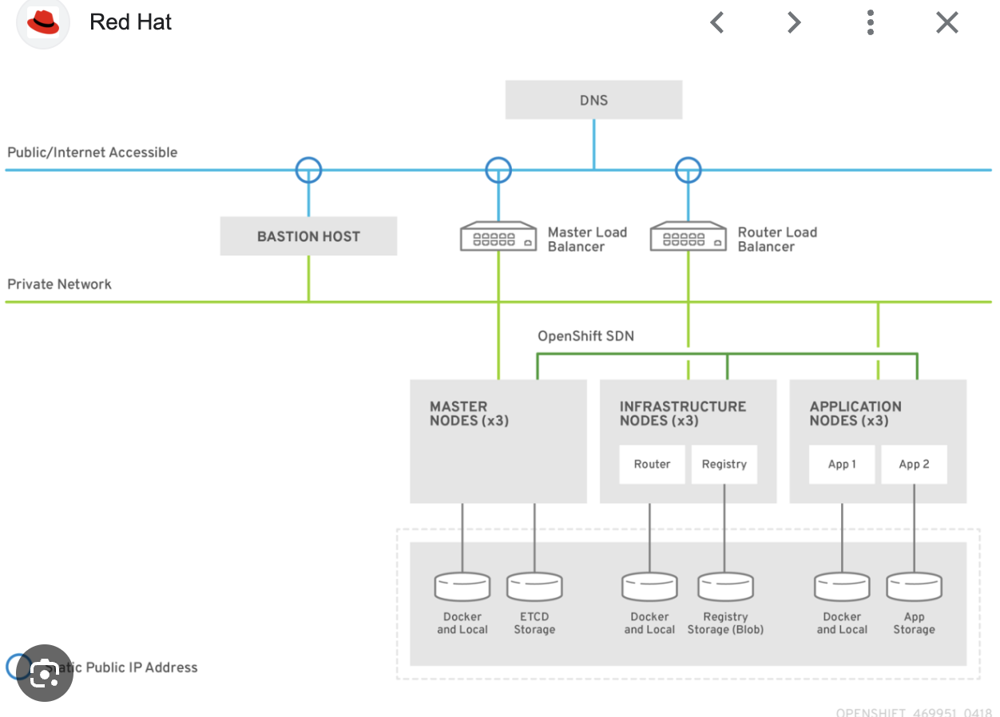

# 4-3 애플리케이션 확장 및 외부 액세스에 노출

# 애플리케이션 확장 및 외부 액세스 노출하기

---

## 목표

- Kubernetes 인그레스 및 OpenShift 경로를 사용하여 클러스터 외부의 클라이언트에 애플리케이션을 노출한다.

## 포드 및 서비스의 IP 주소

- 대부분의 실제 애플리케이션은 단일 포드로 구동되지 않는다.
- 서비스는 IP/포트 결합을 정의하며 포드 풀에 IP 주소를 제공하여 연결 시킨다.
    - 서비스는 종류의 프록시 역할을 하며, IP 주소를 가진 pod와 직접 통신하지 않는다. 대신 서비스의 IP 주소나 DNS 이름을 통해 통신한다.
- 기본적으로 서비스는 라운드 로빈 방식으로 클라이언트를 포드에 연결한다.
- 포드 내 컨테이너는 서로의 동적 IP 주소로 직접 연결되어서는 안 된다.

### 서비스 유형

- **ClusterIP**
    - 기본 서비스 유형.
    - 클러스터 내부 IP 주소에서 서비스를 노출한다.
    - 클러스터 내부에서만 서비스에 액세스 가능하다.
- **Load Balancer**
    - RHOCP가 클라우드 환경에서 로드 밸런서를 활성화하도록 한다.
    - 로드 밸런서는 외부에서 액세스 가능한 IP 주소를 제공한다.
    - 이 유형을 사용할 때는 추가적인 보안 구성이 필요하다.
- **ExternalIP**
    - 클러스터 노드의 가상 IP 주소에서 트래픽을 포드로 리디렉션한다.
    - 추가 인프라 구성이 필요하다.
    - 클러스터 노드를 외부에 노출하므로 추가적인 보안 조치가 필요하다.
- **NodePort**
    - Kubernetes가 노드 IP 주소의 포트에서 서비스를 노출한다.
    - 모든 클러스터 노드에서 트래픽이 서비스의 엔드포인트로 리디렉션된다.
    - 클러스터 노드에 직접적인 네트워크 연결이 필요하며, 이는 보안 위험을 수반한다.
- **ExternalName**
    - DNS 이름이 서비스를 지원하는 리소스의 위치라는 것을 Kubernetes에 알린다.
    - 클라이언트는 반환된 이름을 조회하여 IP 주소를 가져온다.

# 외부 연결을 위한 라우트 사용

- **개요**
    - RHOCP는 클러스터 외부의 외부 네트워크에 애플리케이션을 노출시키기 위한 리소스를 제공한다.
    - HTTP, HTTPS, TCP 애플리케이션 및 비TCP 트래픽을 노출할 수 있다.
    - **Kubernetes의 ingress와 OCP의 route는 둘다 외부 트래픽을 클러스터 내로 라우팅 하기 위해 사용**

- **RHOCP의 외부 연결 방법**
    - **`RHOCP`**는 애플리케이션을 외부 네트워크에 노출하기 위해 **`route`** 리소스를 제공한다.
        
        ```bash
        외부 - 트래픽 → pod
        ```
        
        - 외부에서 오는 트래픽을 pod로 연결시킨다.
        - 라우트를 통해 애플리케이션에 공개적으로 액세스 가능한 고유한 호스트 이름을 제공한다.
        - Kubernetes 인그레스 컨트롤러에 의존하여 트래픽을 공용 IP 주소에서 포드로 리디렉션한다.
        - RHOCP 클러스터에서는 ingress 컨트롤러가 OpenShift ingress 오퍼레이터에 의해 제공된다.
    
- **애플리케이션의 외부 액세스 방법**
    - 외부 액세스는 OpenShift 클러스터 외부에서 애플리케이션 pod로의 트래픽을 의미한다.
        - 이를 위한 주요 리소스는 'Route'이다.
        - **`'Route'는 OpenShift 전용 리소스로,`** 외부에서의 액세스를 관리한다.
    - `Kubernetes`에서는 '`Ingress`'를 사용하여 서비스를 외부에 노출시킨다.
        - Kubernetes의 Ingress와 OpenShift의 Route는 기능적으로 유사하지만 몇 가지 중요한 차이점이 존재한다.
        - **`Ingress`**: 기본적으로 HTTP/HTTPS 라우팅을 제공. 추가 기능은 사용하는 Ingress 컨트롤러에 따라 다릅니다 (예: nginx, traefik)
        - **`Route`**: HTTP/HTTPS 라우팅 및 TLS 종료, 경로 기반 라우팅, 서브도메인 기반 라우팅, 웹소켓, 그리고 스티키 세션과 같은 고급 라우팅 기능을 제공한다..
            - TLS 재암호화, TLS 패스스루 및 블루-그린 배포를 위한 분할 트래픽과 같은 고급 기능을 제공한다.
    
- **라우트 생성**
    - `oc **expose** service service-name` 명령을 사용하여 라우트(보안 또는 비보안)를 생성한다.
    - 라우트에 대한 사용자 정의 호스트 이름을 제공하려면 `-hostname` 옵션을 포함한다.
    - 예제:
        
        ```
        [user@host ~]$ oc **expose** service api-frontend \
        									--hostname api.apps.acme.com
        ```
        
- **라우트 호스트 이름**
    - RHOCP는 다음 구조로 호스트 이름을 자동 생성한다:
    
    ```yaml
    <route-name>-<project-name>.<default-domain>
    ```
    
    - DNS 서버는 라우트 호스트 이름을 인식하지 않으며, 구성된 IP로만 이름을 해석한다.
    - RHOCP 라우터만이 라우트 호스트 이름을 알고 있으며, 각각을 HTTP 가상 호스트로 취급한다.

- 참고: **라우트 생성 시 고려 사항**
    - 서비스의 이름: 라우트는 트래픽을 어느 포드로 전달할지 결정하기 위해 서비스를 사용한다.
    - 라우트의 호스트 이름: 라우트는 항상 클러스터 와일드카드 도메인의 하위 도메인이다.
    - 선택적 경로: 경로 기반 라우트를 위해.
    - 애플리케이션에서 수신 대기하는 대상 포트: 대상 포트는 서비스의 `targetPort` 키에서 정의한 포트에 해당한다.

- **라우트 정의 예제**
    
    ```yaml
    kind: Route
    apiVersion: route.openshift.io/v1
    metadata:
      name: a-simple-route
      labels:
        app: API
        name: api-frontend
    spec:
      host: api.apps.acme.com
      to:
        kind: Service
        name: api-frontend
      port:
        targetPort: 8443
    
    ```
    
- **참고 사항**
    - Openshift의 Ecosystem의 일부 구성 요소는 인그레스 리소스와 통합되지만 라우트 리소스와는 통합되지 않는다. (K8S를 기본으로 개발되었기 때문)
    - RHOCP는 인그레스 객체가 생성될 때 관리되는 라우트 객체를 자동으로 생성한다.
    - RHOCP에서는 인그레스를 사용할 수 있지만, OpenShift의 확장 기능과 통합을 원하는 경우 "라우트"를 사용하는 것이 좋다.
- **라우트 삭제**
    
    ```
    [user@host ~]$ oc delete route myapp-route
    ```
    

# 참고: **Ingress 객체를 사용한 외부 연결**

- **Ingress 개요**:
    - Ingress는 RHOCP의 'route'와 같은 기능의 일부를 제공하는 **`Kubernetes 리소스`**입니다.
    - Ingress 객체는 외부 요청을 받아 경로를 기반으로 요청을 전달합니다.
    - HTTP, HTTPS 및 SNI와 함께 TLS와 같은 특정 유형의 트래픽만 활성화할 수 있습니다.
    - Kubernetes의 표준 Ingress 리소스는 대체로 기본적입니다.
    - RHOCP에서는 ingress 객체가 지정한 조건을 충족하기 위해 경로(route)가 생성됩니다.
- **NOTE**: Kubernetes에서는 일반적으로 ingress 리소스를 사용한다. 그러나 RHOCP에서 외부 연결의 선호 방법은 'route' 리소스 이다.

- **Ingress 객체 생성**:
    - Ingress 객체를 생성하려면 `oc create ingress` 명령을 사용합니다.
        
        ```bash
        [user@host ~]$ oc create ingress ingr-sakila --rule="ingr-sakila.apps.ocp4.example.com/*=sakila-service:8080"
        ```
        
- **Ingress 객체의 기본 정의**:
    
    ```yaml
    apiVersion: networking.k8s.io/v1
    kind: Ingress
    metadata:
      name: frontend  # Ingress 객체의 이름입니다. 이 이름은 고유해야 합니다.
    spec:
      rules:
      - host: "www.example.com"  # Ingress 객체의 호스트입니다.
        http:
          paths:
          - backend:
              service:
                name: frontend
                port:
                  number: 80  # 트래픽을 리디렉션할 백엔드입니다.
            pathType: Prefix
            path: / 
      tls:
      - hosts:
        - www.example.com
        secretName: example-com-tls-certificate  # Ingress 객체에 대한 TLS의 구성입니다.
    ```
    
- **Ingress 객체 삭제**:
    
    ```
    [user@host ~]$ oc delete ingress example-ingress
    ```
    

# Cluster IP를 이용한 외부 액세스 구현

- OpenShift에서 애플리케이션에 대한 외부 액세스를 구현하는 가장 간단한 형태는 클러스터 IP를 사용하는 것이다.
- oc expose 명령을 사용하여 서비스를 노출시키고, 이를 통해 Route를 생성할 수 있다.
    - 세부내용1: 예제 코드
        
        ```bash
        oc expose svc/web2
        oc get route -l app=web2
        ```
        

# **Sticky sessions (고정 세션)**:

- **Sticky sessions**은 동일한 엔드포인트에 모든 요청이 도달하도록 하여 상태를 가진 애플리케이션 트래픽을 활성화합니다.
- RHOCP는 ingress 및 route 리소스에 대해 세션 지속성은 쿠키를 통해 이루어 진다.
    - 쿠키는 어플리케이션 pod에 의해 발행되어, 사용자 브라우저에 저장된다.
- Ingress 컨트롤러는 사용자 요청을 처리할 엔드포인트를 선택하고 세션에 대한 쿠키를 생성합니다.
    - 쿠키는 사용자가 이전에 어느 엔드포인트와 통신했는지를 알려주어, 이후 요청에서도 같은 엔드포인트로 요청을 보낼 수 있도록 합니다.
- **쿠키 설정 예제**
    - Ingress 객체에 대한 쿠키 구성:
        
        ```
        [user@host ~]$ oc annotate ingress ingr-example **ingress.kubernetes.io/affinity=cookie**
        ```
        
    - 경로(route) 객체에 대한 쿠키 구성:
        
        ```
        [user@host ~]$ oc annotate route route-example **router.openshift.io/cookie_name=myapp**
        
        ```
        
    
    **Sticky sessions 예제**
    
    1. 먼저 경로(route)의 호스트 이름을 변수에 저장합니다:
        
        ```
        [user@host ~]$ ROUTE_NAME=$(oc get route <route_name> -o jsonpath='{.spec.host}')
        ```
        
    2. curl 명령을 사용하여 쿠키를 저장하고 경로에 액세스합니다:
        
        ```
        [user@host ~]$ curl $ROUTE_NAME -k -c /tmp/cookie_jar
        ```
        
    3. 저장된 쿠키를 사용하여 경로에 연결합니다:
        
        ```
        [user@host ~]$ curl $ROUTE_NAME -k -b /tmp/cookie_jar
        ```
        

# **애플리케이션의 로드 밸런싱 및 확장**

- **애플리케이션 확장**:
    - 개발자와 관리자는 배포에서 복제본(pod)의 수를 수동으로 확장할 수 있습니다.
    - 예상되는 트래픽 급증을 위해 더 많은 pod가 필요할 수 있으며, 클러스터가 다른 곳에서 사용할 수 있는 리소스를 회수하기 위해 pod 수를 줄일 수도 있습니다.
    - `oc scale` 명령을 사용하여 배포 리소스의 복제본 수를 수동으로 변경할 수 있습니다.
        
        ```
        [user@host ~]$ oc scale --replicas 5 deployment/scale
        ```
        
    - 배포 리소스는 변경 사항을 복제본 집합(replica set)에 전파합니다. 복제본 집합은 새로운 복제본 수가 기존 수보다 적거나 많은지에 따라 pod를 생성하거나 기존 pod를 삭제하여 변경에 반응합니다.
    - 복제본 집합 리소스를 직접 조작할 수 있지만 권장하는 방법은 대신 배포 리소스를 조작하는 것입니다.
- **Pod의 로드 밸런싱**:
    - Kubernetes 서비스는 내부 로드 밸런서 역할을 합니다.
    - 표준 서비스는 로드 밸런서 또는 프록시 역할을 하며 서비스 이름을 사용하여 작업 로드 객체에 접근합니다.
    - 서비스는 연결을 전송할 복제된 pod 집합을 식별합니다.
    - 라우터는 서비스 선택자를 사용하여 서비스와 해당 서비스를 지원하는 엔드포인트 또는 pod를 찾습니다.
    - 라우터와 서비스 모두 로드 밸런싱을 제공할 때 RHOCP는 라우터를 사용하여 트래픽을 pod에 로드 밸런싱합니다.
    - 라우터는 서비스의 IP 주소에서 관련 변경 사항을 감지하고 그에 따라 구성을 조정합니다.

**예제**:

1. 특정 배포의 pod 수를 5로 확장하려면:
    
    ```
    [user@host ~]$ oc scale --replicas 5 deployment/your-deployment-name
    
    ```
    

### **참고**

