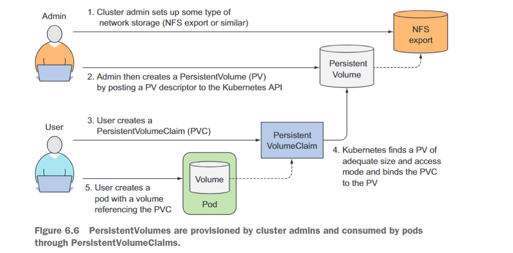

# 5-1 영구 데이터 볼륨 프로비저닝

# 개요

- 컨테이너는 기본적으로 일시적인 저장소를 가짐.
- 일시적인 저장소의 생명 주기는 해당 파드의 생명 주기를 넘어서지 않음.
- 상태가 있는(stateful) 애플리케이션은 생성된 데이터를 보존해야 하는 애플리케이션을 말한다. 이러한 데이터는 영구적인 볼륨에 저장되어야 한다.

# Persistent Volume (PV) 프레임워크

- OpenShift (or Kubernetes)에서 Persistent Volume (PV) 프레임워크는 사용자와 클러스터 관리자 모두에게 스토리지를 프로비저닝하고 관리하도록 한다.
- 사용자의 데이터를 지속적으로 저장하기 위해 사용된다.

## PV 프레임워크의 주요 구성 요소

**Kubernetes in Action**

- **Storage**
    - **정의**: OpenShift에서의 데이터 저장 공간이나 메커니즘.
    - **정의방법**: 물리적인 디스크, 네트워크 기반의 스토리지 시스템, 클라우드 스토리지 등으로 구현.
    - **사용 주체**: OpenShift 클러스터의 여러 컴포넌트나 사용자 서비스.
    - **동작 방식**: 저장 요청 시, 해당 스토리지로 데이터를 기록하거나 읽어옴.
    - **특징**: 다양한 형태로 존재하며 확장성과 유연성을 제공함.

- **StorageClass**
    - **정의**: 동적 볼륨 프로비저닝을 위한 "템플릿".
    - **정의방법**: 특정 스토리지 프로비저너와 그에 따른 설정을 포함.
    - **사용 주체**: 사용자나 관리자가 PVC 생성 시.
    - **동작 방식**: PVC 생성 요청에 따라 StorageClass를 기반으로 PV를 동적으로 프로비저닝.
    - **특징**: 다양한 클라우드 스토리지 서비스를 프로비저너로 사용할 수 있음.
    
- **Volume**
    - **정의**: 컨테이너에서 사용 가능한 저장 공간.
    - **정의방법**: PV와 PVC로 구분하여 정의.
    - **사용 주체**: OpenShift 클러스터 내의 파드나 서비스.
    - **동작 방식**: 파드에서 데이터 저장 요청 시 해당 볼륨으로 데이터를 기록하거나 읽어옴.
    - **특징**: 데이터의 영속성과 접근성을 제공함.
    
- **Persistent Volume, PV**
    - **정의**: 클러스터 내에서 사용되는 영구 스토리지 리소스.
    - **정의방법**: 클러스터 외부 스토리지와의 연결 정보와 속성으로 정의.
    - **사용 주체**: 클러스터 전체.
    - **동작 방식**: PVC와의 바인딩을 통해 데이터 저장소로 활용됨.
    - **특징**: 모든 네임스페이스에서 사용 가능하며, PVC에 의존하지 않는 독립적인 수명 주기를 가짐.
    
- **Persistent Volume Claim, PVC**
    - **정의**: 사용자에 의해 요청되는 스토리지 공간.
    - **정의방법**: 필요한 크기, 액세스 모드 등의 속성으로 정의.
    - **사용 주체**: 특정 네임스페이스 내의 사용자나 서비스.
    - **동작 방식**: PV와 바인딩되어 실제 스토리지 리소스를 사용하게 됨.
    - **특징**: 네임스페이스에 속하며, 바인딩된 PV의 스토리지 리소스를 사용할 수 있음.

- **PersistentVolume 및 PersistentVolumeClaim 볼륨의 역할 분리**
    - **Kubernetes Cluster 관리자(스토리지 지식 보유) 또는 스토리지 관리자**:
        - PV 리소스를 생성하고 외부 스토리지와 연결한다.
    - **애플리케이션 개발자**:
        - PVC 를 생성하여 미리 정의된 PV에 연결을 요청한다.
        - 생성된 PVC를 사용하여 파드에 볼륨을 제공할 수 있다.
    - **파드**
        - PVC를 통해 PV에 접근하고, 이를 통해 스토리지 리소스를 사용한다.

## **저장소 프로비저닝**

- **정적 프로비저닝 (Static Provisioning)**
    - PV 및 PVC 리소스를 직접 생성하고 사용하는 방식
    - PVC를 사용하기 위해서는 클러스터 관리자가 사용 가능한 PV를 미리 생성해야 한다.
    - 클러스터 관리자는 저장 장치, 지원되는 구성 및 마운트 옵션의 세부 정보를 알고 있어야 한다.
    
           [https://www.alibabacloud.com/blog/kubernetes-persistent-storage-proc1es1s4_596505](https://www.alibabacloud.com/blog/kubernetes-persistent-storage-proc1es1s4_596505)
    
- **동적 프로비저닝 (Dynamic Provisioning)**
    - PV 및 PVC 리소스를 자동으로 생성하고 사용하는 방
    - 스토리지 기능 및 분류 정보를 담은 스토리지 클래스(StorageClass) 리소스만 정의해두면 된다.
    - 개발자가 PVC를 요청하면 스토리지 클래스 리소스에 의해 PV가 자동으로 프로비저닝되어 제공된다.
    - 동적 프로비저닝을 사용하면 클러스터 관리자가 스토리지를 사전 프로비저닝할 필요가 없다.
    - 동적 프로비저닝은 스토리지 클래스를 사용한다.

[https://www.alibabacloud.com/blog/kubernetes-persistent-storage-proc1es1s4_596505](https://www.alibabacloud.com/blog/kubernetes-persistent-storage-proc1es1s4_596505)

## **볼륨 및 클레임의 라이프사이클**

[https://blog.mayadata.io/kubernetes-storage-basics-pv-pvc-and-storageclass](https://blog.mayadata.io/kubernetes-storage-basics-pv-pvc-and-storageclass)

1. **스토리지 클래스 (StorageClass) 생성**:
    - 클러스터 관리자는 동적 프로비저닝을 위한 `StorageClass`를 생성합니다.
    - 이 `StorageClass`는 동적 프로비저닝을 위한 설정을 포함하며, 특정 스토리지 타입 (예: AWS EBS, Google PD, GlusterFS 등)에 대한 프로비저너와 파라미터를 정의 한다.
2. **영구 볼륨 요청 (PVC) 생성**:
    - 사용자 또는 애플리케이션은 스토리지 요구사항을 PVC를 통해 표현합니다.
    - PVC는 필요한 스토리지 크기, 액세스 모드, 선택적으로 StorageClass 등을 지정할 수 있습니다.
    - PVC가 생성되면, Kubernetes는 해당 PVC의 요구 사항을 만족하는 PV를 찾습니다.
    - PV는 특정 PVC에 바인딩되면 다른 PVC에 바인딩될 수 없습니다.
3. **동적 프로비저닝**:
    - 만약 PVC가 특정 `StorageClass`를 지정하고 일치하는 PV가 없으면, 해당 `StorageClass`의 프로비저너가 동적으로 PV를 생성합니다.
    - 이렇게 생성된 PV는 자동으로 PVC에 바인딩됩니다.
4. **사용**:
    - 바인딩된 PVC는 포드에서 사용될 수 있습니다.
    - PVC는 포드의 볼륨으로 마운트되고 데이터는 PV에 저장됩니다.
5. **해제**:
    - 포드가 삭제되거나 PVC에 대한 참조가 더 이상 필요하지 않을 때 PVC는 해제 상태가 됩니다.
    - PVC의 삭제 정책에 따라 PV의 데이터는 보존(보존), 삭제(삭제) 또는 재활용(재활용) 될 수 있습니다.
6. **PVC 삭제**:
    
            Figure 5.2: PV lifecycle
    
    - PVC를 삭제하면 연결된 PV의 상태는 PVC의 삭제 정책에 따라 결정됩니다.
    - `Retain` 정책: PV가 시스템에서 보존되며 데이터도 보존됩니다.
    - `Delete` 정책: PV와 관련 데이터가 모두 삭제됩니다.
    - `Recycle` 정책: PV의 데이터만 삭제되고 PV 자체는 재사용될 수 있습니다.

# **볼륨 접근 모드**

- PVC에는 크기(size)와 접근 모드(access mode)가 작성된다.

```yaml
spec:
  accessModes:
    - ReadWriteOnce
  resources:
    requests:
      storage: 8Gi
```

**Volume Access Modes**

- 파드가 스토리지에 접근하는 방식을 결정한다. 이는 스토리지 공급자에 따라 다르게 제공
    
    
    | Access mode | Abbreviation | Description |
    | --- | --- | --- |
    | ReadWriteOnce | RWO | 하나의 노드만 볼륨을 읽기/쓰기로 마운트. |
    | ReadOnlyMany | ROX | 여러 노드가 볼륨을 읽기 전용으로 마운트. |
    | ReadWriteMany | RWX | 여러 노드가 볼륨을 읽기/쓰기로 마운트. |

### Persistant Volume 의 종류

- **configMap**:
    - 애플리케이션 구성 정보를 저장하고 관리하는 Kubernetes 리소스.
    - 컨테이너 이미지나 코드에서 구성을 분리하고, 환경 설정 정보나 설정 파일의 내용 등을 포드에 주입할 수 있음.
    - 디스크나 영구 스토리지와 같이 동작하지 않음.
- **emptyDir**:
    - 포드가 할당된 노드에서 일시적으로 생성되는 스토리지.
    - 포드의 생명 주기와 연결되어 있어, 포드가 삭제되면 emptyDir 내의 데이터도 삭제됨.
    - 임시 데이터 저장용으로 주로 사용됨.
- **hostPath**:
    - 클러스터 노드의 파일시스템에 있는 파일이나 디렉터리를 포드에 직접 마운트.
    - 특정 노드에 종속적이며, 프로덕션 환경에서의 사용은 권장되지 않음.
- **iSCSI**:
    - IP 네트워크를 통해 외부 스토리지에 블록 수준 액세스를 제공하는 스토리지 프로토콜.
    - Kubernetes 포드가 iSCSI 대상의 영구 스토리지를 사용하게 해줌.
- **local**:
    - 노드의 로컬 디스크를 직접 사용하는 영구 스토리지.
    - 해당 노드의 가용성에 따라 데이터의 가용성도 달라짐.
- **NFS**:
    - 네트워크 파일 시스템 프로토콜을 사용하여 스토리지를 제공.
    - 여러 포드 간에 공유 데이터를 제공할 수 있어, 동시에 여러 포드에서 액세스가 가능.
    - 일반적으로 데이터를 안전하게 공유할 수 있는 방법으로 많이 사용됨.
- **액세스 모드 지원**
    
    
    | 볼륨 유형 | RWO | ROX | RWX |
    | --- | --- | --- | --- |
    | configMap | 예 | 아니요 | 아니요 |
    | emptyDir | 예 | 아니요 | 아니요 |
    | hostPath | 예 | 아니요 | 아니요 |
    | iSCSI | 예 | 예 | 아니요 |
    | local | 예 | 아니요 | 아니요 |
    | NFS | 예 | 예 | 예 |

## Storage 별 분류

1. **블록 스토리지 (Block Storage)**:
    - 고정 크기의 데이터 블록을 저장하며, 일반적으로 가장 낮은 수준의 스토리지로서 파일 시스템 또는 데이터베이스와 같은 고급 스토리지 구조를 지원
    - **Amazon EBS**
    - **Google Persistent Disk**
    - **Azure Disk**
    - **Ceph RBD (Rados Block Device)**
    - **Cinder**
    - **vSphere Volume**
    - **FC (Fibre Channel)**
    - **Portworx**
    - **StorageOS**
2. **파일 시스템 (File Systems)**:
    - 데이터를 파일 및 디렉터리 형태로 저장하고, 공유 및 접근을 위한 프로토콜을 제공
    - **GlusterFS**
    - **CephFS**
    - **Quobyte**
3. **오브젝트 스토리지 (Object Storage)**:
    - 대규모의 비구조화된 데이터를 저장하기 위해 설계된 스토리지 유형입니다. 각 오브젝트에는 고유한 ID와 메타데이터가 부여됩니다.
    - **S3**
    - **Google Cloud Storage**
    - **Ceph Object Storage**
    - **MinIO**

**블록 볼륨 지원**

| 볼륨 플러그인 | 수동으로 프로비저닝됨 | 동적으로 프로비저닝됨 |
| --- | --- | --- |
| AWS EBS | 예 | 예 |
| Azure 디스크 | 예 | 예 |
| Cinder | 예 | 예 |
| 파이버 채널 | 예 | 아니요 |
| GCP | 예 | 예 |
| iSCSI | 예 | 아니요 |
| local | 예 | 아니요 |
| Red Hat OpenShift Data Foundation | 예 | 예 |
| VMware vSphere | 예 | 예 |

## storage class

- storageclass 확인

```bash
oc get storageclass
```

# 예제

## CLI

```jsx
apiVersion: v1
kind: PersistentVolumeClaim
metadata:
  name: my-pvc
spec:
  accessModes:
    - ReadWriteOnce
  resources:
    requests:
      storage: 1Gi
```

```jsx
oc create -f my-pvc.yaml
```

- **Pod에 PVC 할당**
Pod를 정의하는 YAML 파일에 PVC를 마운트하도록 추가합니다. 예를 들어 **`my-pod.yaml`**이라는 파일명으로 다음과 같이 작성

```yaml
apiVersion: v1
kind: Pod
metadata:
  name: my-pod
spec:
  containers:
  - name: my-container
    image: nginx
    volumeMounts:
    - mountPath: /usr/share/nginx/html
      name: my-volume
  volumes:
  - name: my-volume
    persistentVolumeClaim:
      claimName: my-pvc
```

- 이 YAML 파일은 nginx 이미지를 기반으로하는 Pod를 생성하며, **`/usr/share/nginx/html`**에 **`my-pvc`**로부터 제공받는 스토리지를 마운트한다.
- 이후 **`oc`** 명령어로 Pod를 생성

```bash
oc create -f my-pod.yaml
```

- 이렇게 하면 PVC가 Pod에 연결되어 스토리지를 제공할 수 있다.

# 실습 참고

- lab 3번에서 해당 내용 수정하세요
    - KEY: MYSQL_DATABASE , VALUE: 항목 (X)
    - KEY: MYSQL_DATABASE , VALUE: items (O)