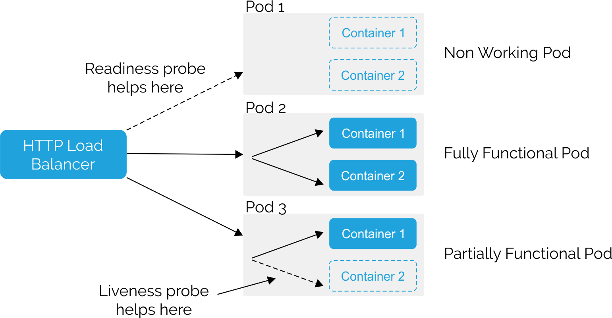

# 6-1 애플리케이션 상태 프로브

# Monitoring application health by using health checks

- 애플리케이션은 다양한 이유로 인해 불안정해질 수 있다.
    - 일시적인 연결 끊김 (network)
    - 구성 오류 (config)
    - 애플리케이션 오류 (application)
- 이러한 이유로 애플리케이션을 OpenShift에 배포하는 최선의 방법 중 하나는 `시작, 준비 및/또는 생존 프로브`를 구현하여 지속적으로 애플리케이션의 health checks를 진행해준다.
- OpenShift는 이러한 Probe 를 통해 애플리케이션의 문제를 파악하고, 애플리케이션을 재시작하거나 새 인스턴스를 시작하는 등의 대응을 할 수 있다.

# Probe 종류

[https://blog.hax0r.info/2019-12-30/kubernetes-healthy/](https://blog.hax0r.info/2019-12-30/kubernetes-healthy/)

### Readiness Probe

- Pod 내 컨테이너가 트래픽을 받을 준비가 되었는지 확인합니다.
- **대상**: 컨테이너
- **동작**:
    - 레디니스 프로브는 컨테이너가 준비 상태인지 확인하여, 준비가 되지 않은 경우 서비스에서 해당 Pod로의 트래픽을 차단합니다.
    - 준비 상태가 된 후에야 클러스터의 서비스가 해당 컨테이너로 트래픽을 라우팅한다
    - 이 프로브가 실패하면 해당 Pod의 IP는 서비스 엔드포인트에서 제거된다

```yaml
apiVersion: v1
kind: Pod
metadata:
  labels:
    test: health-check
  name: my-application
# ...
spec:
  containers:
  - name: goproxy-app 
    args:
    image: registry.k8s.io/goproxy:0.1 
    **readinessProbe: 
      exec: 
        command: 
        - cat
        - /tmp/healthy**
# ...
```

### Liveness Probe

- 컨테이너가 제대로 동작하고 있는지 확인한다
- **대상**: 컨테이너
- **동작**:
    - 라이브니스 프로브는 컨테이너가 살아있는지(정상적으로 동작하는지) 확인하여, 비정상 상태일 경우 컨테이너를 재시작한다
    - 프로브가 실패하면 kubelet은 해당 컨테이너를 중지시키고, 재시작 정책에 따라 다시 시작한다

```yaml
apiVersion: v1
kind: Pod
metadata:
  labels:
    test: health-check
  name: my-application
# ...
spec:
  containers:
  - name: goproxy-app 1
    args:
    image: registry.k8s.io/goproxy:0.1 2
    **livenessProbe: 3
      httpGet: 4
        scheme: HTTPS 5
        path: /healthz
        port: 8080 6**
        httpHeaders:
        - name: X-Custom-Header
          value: Awesome
```

### Startup Probe

- 컨테이너가 정상적으로 시작되었는지 확인합니다.
- **대상**: 컨테이너
- **동작**:
    - 스타트업 프로브는 컨테이너가 시작 시 정상적으로 초기화되었는지 확인합니다.
    - 설정된 주기 동안 스타트업 프로브가 성공하면, 레디니스 프로브와 라이브니스 프로브가 활성화되어 컨테이너의 상태를 계속 모니터링합니다.
    - 설정된 주기 동안 스타트업 프로브가 실패하면 kubelet은 컨테이너를 중지시키고, 재시작 정책에 따라 컨테이너를 다시 시작합니다.
    - 스타트업 프로브가 성공할 때까지는 레디니스 프로브와 라이브니스 프로브가 비활성화됩니다.

```yaml
apiVersion: v1
kind: Pod
metadata:
  labels:
    test: health-check
  name: my-application
# ...
spec:
  containers:
  - name: goproxy-app 
    args:
    image: registry.k8s.io/goproxy:0.1 
    livenessProbe: 
      httpGet: 
        scheme: HTTPS 
        path: /healthz
        port: 8080 
        httpHeaders:
        - name: X-Custom-Header
          value: Awesome
    **startupProbe: 
      httpGet: 
        path: /healthz
        port: 8080 
      failureThreshold: 30 
      periodSeconds: 10** 
# ...
```

### 프로브 체크의 종류

- Readiness Probe, Liveness Probe, Startup Probe는 각각 HTTP 체크, 컨테이너 실행 체크, TCP 소켓 체크를 지원
- `HTTP ckeck`: 애플리케이션의 Health 상태를 확인하는 데 사용할 수 있는 체크 방법
    - HTTP 체크는 웹 페이지나 HTTP 상태 코드를 반환할 수 있는 HTTP 타입의 서비스가 건강한 응답을 반환하고 있는지 확인하는 데 유용하다.
    - 이 프로브는 200에서 399 범위 내의 응답 코드를 반환하면 체크가 성공한 것으로 간주한다.
    - 프로브 생성 방법은 oc set 명령어를 사용하거나 YAML을 이용하는 방법이 있다.
    
    ```yaml
    readinessProbe:
      httpGet:
        path: /health
        port: 8080
      initialDelaySeconds: 3
      periodSeconds: 10
    ```
    

- `container execution check`
    - 개발자가 지시한 명령을 실행하고 오류 메시지 없이 0 상태의 종료 코드를 반환하면 성공
    - 명령어가 실행되었지만 종료 코드가 0보다 크면 실패
    
    ```yaml
    **livenessProbe: 
      exec: 
        command: 
        - /bin/bash
        - '-c'
        - timeout 60 /opt/eap/bin/livenessProbe.sh**
    ```
    
- `TCP Socket check`
    - 특정 포트가 수신 대기 중인지 확인
    - 데이터베이스가 특정 포트에서 수신 대기 중이거나 웹 서비스가 특정 포트에서 수신 대기 중일 경우에 사용할 수 있다.
    - 포트가 실제로 수신 대기 중이면 성공
    
    ```yaml
    readinessProbe: 1
      tcpSocket:
        port: 8080
    ```
    

### 프로브의 타이밍 옵션

- 프로브의 타이밍을 제어하는 파라미터
- initialDelaySeconds와 timeoutSeconds가 필수적으로 포함 되어야 한다.
    - **`initialDelaySeconds`**: 컨테이너가 시작된 후 프로브가 예약되기 전에 대기하는 시간(초). 기본값은 0.(필수)
    - **`timeoutSeconds`**: 프로브가 타임아웃되고 컨테이너가 실패한 것으로 간주되기까지의 비활성 시간(초). 기본값은 1이다. 이 값은 periodSeconds보다 낮아야 한다. (프로브가 완료되기를 기다릴 시간을 결정)(필수)
    - **periodSeconds**: 프로브를 수행하는 간격(초). 기본값은 10입니다. 이 값은 timeoutSeconds보다 커야 합니다.
    - **successThreshold**: 프로브가 실패 후 몇 번 성공해야 컨테이너 상태가 성공으로 재설정되는지의 횟수. 라이브니스 프로브의 경우 이 값은 1이어야 합니다. 기본값은 1입니다.
    - **failureThreshold**: 프로브가 실패를 허용하는 횟수. 기본값은 3입니다. 지정된 시도 후에는 다음과 같이 동작한다.
        - 라이브니스 프로브의 경우, 컨테이너가 재시작됩니다.
        - 레디니스 프로브의 경우, 파드가 Unready로 표시됩니다.
        - 스타트업 프로브의 경우, 컨테이너가 종료되며 파드의 재시작 정책이 적용됩니다.
    

### oc set 명령어를 이용한 프로브 설정

- oc set 명령어를 사용하면 배포 리소스나 배포 구성에 이 정보를 설정하는 것이 더 쉬울 수 있다.
- oc set probe를 사용하면 readiness probe인지, liveness probe인지 지정하고, 옵션을 설정할 수 있다.
- oc set probe를 사용하면, http 체크를 위해 get-url을 사용하거나, 열린 포트를 체크하기 위해 open-tcp를 사용할 수 있다.

```bash
oc set probe deployment/myapp --readiness --get-url=http://:8080/health --initial-delay-seconds=5 --timeout-seconds=5
```