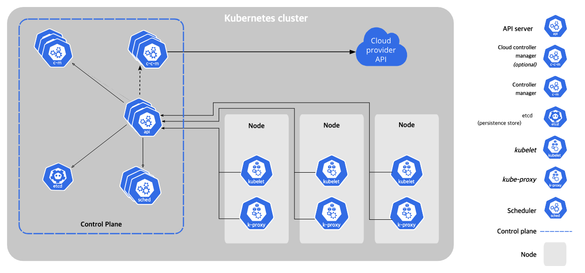

# 6-2 애플리케이션의 컴퓨팅 용량 예약

# Control Plane

- Kubernetes 클러스터의 관리와 제어를 담당하는 모든 구성 요소의 집합
- 주요 기능
    - **Controller Manager (kube-controller-manager)**: 다양한 컨트롤러(예: 레플리카셋 컨트롤러, 배포 컨트롤러 등)를 실행하여 클러스터의 desired state를 유지
    - **Scheduler (kube-scheduler)**: 새로운 파드(Pod)를 적절한 워커 노드에 할당하여 배치한다
    - **API Server (kube-apiserver)**: Kubernetes API를 제공하여 클러스터와의 모든 통신을 관리한다
    - **etcd**: 클러스터의 모든 구성 데이터를 저장하고, 분산 키-값 저장소를 호스팅한다

# **OpenShift 노드의 일반적인 구성**


[Provision Red Hat OpenShift Cluster On AWS | LinkedIn](https://www.linkedin.com/pulse/provision-red-hat-openshift-cluster-aws-darshana-dinushal/)

OpenShift 클러스터에는 최소 세 개의 Control plane node (Master node 라고도 함)가 권장 된다.

- 고가용성(High Availability): 세 개의 노드를 사용하면 한 노드에 장애가 발생(다운)해도 클러스터가 계속 작동할 수 있습니다.
- 쿼럼(Quorum)유지: etcd 데이터베이스의 일관성과 무결성을 보다 효과적으로 유지 하기 위해 홀수 개의 노드가 필요합니다.
- 부하 분산: 여러 노드에 걸쳐 작업을 분산시킬 수 있습니다.
- 선택적 노드
    - 인프라 노드
        - 추가 도구(예: OpenShift Data Foundation(ODF))를 포함한 인프라 구성 요소를 실행
    - 워커 노드
        - 수량: 사용자 정의 가능, 애플리케이션을 실행하는 노드.

## OpenShift에서 애플리케이션 배포

- 구성 요소
    - 이미지 스트림
    - Deployment
- 배포 결정 요소
    - 노드 Selector
        - 특정 레이블과 일치하는 노드에서만 파드를 인스턴스화하도록 구성.
    - 노드 어피니티
        - 노드 셀렉터와 유사하지만 더 세밀한 제어 가능.
    - 테인트와 톨러레이션
        - 대응하는 톨러레이션이 없는 테인트된 노드를 사용하지 않도록 보장.
    - 리소스 부족
        - 애플리케이션에 대한 리소스 요청을 선언하여 리소스가 부족한 노드에 배포되지 않도록 함.

## Kubernetes 포드 예약

- RHOCP 포드 스케줄러 프로세스
    1. 노드 필터링
        - 포드는 클러스터 노드에서 레이블과 일치하는 노드 selector 를 정의할 수 있습니다. 일치하는 레이블만 사용할 수 있습니다.
        - 스케줄러는 서술자 집합에 대해 각 노드를 평가하여 실행 중인 노드 목록을 필터링합니다. 포드는 CPU, 메모리 및 스토리지 등의 컴퓨팅 리소스에 대한 리소스 요청을 정의할 수 있다.
            - 사용 가능한 컴퓨팅 리소스가 충분한 노드만 사용할 수 있습니다.
        - 필터링 단계에서는 사용가능한 노드 목록을 줄인다. 경우에 따라 포드가 모든 노드에서 실행될 수 있다. 그 밖의 경우 모든 노드가 필터링되며 따라서 적절한 필수 구성 요소를 가진 노드를 사용할 수 있게 될 때까지 포드를 예약할 수 없습니다.
        - 모든 노드가 필터링되면 포드에 대해 FailedScheduling 이벤트가 생성됩니다.
    2. 필터링된 노드 목록의 우선 순위 지정
        - 스케줄러는 여러 우선 순위 기준을 사용하여 각 노드의 가중치 점수를 결정합니다. 점수가 높은 노드는 포드를 실행하기에 더 좋은 후보입니다.
    3. 최적의 노드 선택
        - 이러한 점수를 기반으로 후보 목록을 정렬하며 포드를 호스트하도록 점수가 가장 높은 노드를 선택합니다. 여러 노드에 똑같이 높은 점수가 있으면 하나의 노드가 라운드 로빈 형식으로 선택됩니다. 호스트를 선택하면 포드에 대해 Scheduled 이벤트가 생성됩니다.
        - 스케줄러는 유연성이 있으며 고급 스케줄링 환경에 맞게 사용자 지정할 수 있습니다. 스케줄러 사용자 지정은 이 교육 과정에서 다루지 않습니다.

## 메모리 및 스토리지 단위

- 단위
    - Mi (메비바이트), Gi (기비바이트) 등은 2진수 기반 사용.
    - 10진수 기반 단위(예: 메가바이트(MB), 기가바이트(GB) 등)와의 차이.
- 중요성
    - 올바른 사용은 정확한 리소스 할당과 애플리케이션 성능 보장.

## CPU 단위

- 밀리코어
    - 1000 밀리코어 = 1 코어
    - 사용 예: 100 밀리코어 = 0.1 코어.

## 명령어 및 활용도 확인

- `oc adm top node <node_name>`
    - 노드 활용도 확인.
- `oc adm top pods -n <project_name>`
    - 프로젝트 내 파드 리소스 사용량 확인.
- `oc describe node <node_name> | less`
    - 상세한 노드 용량 및 할당 가능 리소스 확인.
- 웹 콘솔
    - 클러스터 활용도 및 리소스 사용량을 시각적으로 모니터링할 수 있는 인터페이스 제공.

## 예시

### 리소스 요청을 포함한 배포 구성

```yaml
apiVersion: apps/v1
kind: Deployment
metadata:
  name: my-database
spec:
  replicas: 1
  selector:
    matchLabels:
      app: my-database
  template:
    metadata:
      labels:
        app: my-database
    spec:
      containers:
      - name: my-database-container
        image: my-database-image
        resources:
          requests:
            memory: "512Mi"
            cpu: "200m"
          limits:
            memory: "1Gi"
            cpu: "500m"
```