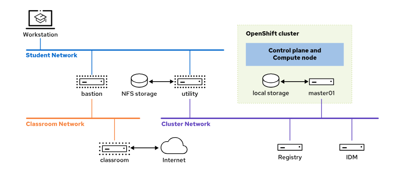

# 시작하며

| 시스템 이름 | IP 주소 | 역할 |
| --- | --- | --- |
| bastion.lab.example.com | 172.25.250.254 | VM을 중앙 서버에 연결하는 라우터 |
| classroom.lab.example.com | 172.25.252.254 | 필수 강의실 자료를 호스팅하는 서버 |
| idm.ocp4.example.com | 192.168.50.40 | 클러스터 인증 및 권한 부여 지원을 위한 ID 관리 서버 |
| master01.ocp4.example.com | 192.168.50.10 | RHOCP 단일 노드(SNO) 클러스터 |
| registry.ocp4.example.com | 192.168.50.50 | 클러스터에 프라이빗 레지스트리 및 GitLab 서비스를 제공하는 레지스트리 서버 |
| utility.lab.example.com | 192.168.50.254 | DHCP, NFS, 클러스터 네트워크로의 라우팅을 포함하여 RHOCP 클러스터에 필요한 지원 서비스를 제공하는 서버 |
| workstation.lab.example.com | 172.25.250.9 | 수강생용 그래픽 워크스테이션 |

**표 2. RHOCP 액세스 방법**

| 액세스 방법 | 엔드포인트 |
| --- | --- |
| 웹 콘솔 | https://console-openshift-console.apps.ocp4.example.com |
| API | https://api.ocp4.example.com:6443 |

## 강의실 레지스트리

- `registry` 서버는 강의실 환경에 `https://registry.ocp4.example.com:8443/` 컨테이너 이미지 레지스트리를 제공합니다. 이 레지스트리는 암호가 `developer` 인 사용자 계정 `developer`로 구성됩니다.

| 강의실 레지스트리 리포지토리 | 퍼블릭 소스 리포지토리 |
| --- | --- |
| redhattraining/docker-nginx | docker.io/library/nginx
quay.io/redhattraining/docker-nginx |
| redhattraining/bitnami-mysql | docker.io/bitnami/mysql
quay.io/redhattraining/bitnami-mysql |
| redhattraining/do180-dbinit | quay.io/redhattraining/do180-dbinit |
| redhattraining/do180-httpd-app | quay.io/redhattraining/do180-httpd-app |
| redhattraining/do180-roster | quay.io/redhattraining/do180-roster |
| redhattraining/famous-quotes | quay.io/redhattraining/famous-quotes |
| redhattraining/hello-world-nginx | quay.io/redhattraining/hello-world-nginx |
| redhattraining/httpd-noimage | quay.io/redhattraining/httpd-noimage |
| redhattraining/long-load | quay.io/redhattraining/long-load |
| redhattraining/loadtest | quay.io/redhattraining/loadtest |
| redhattraining/mysql-app | quay.io/redhattraining/mysql-app |
| redhattraining/php-ssl | quay.io/redhattraining/php-ssl |
| redhattraining/php-webapp | quay.io/redhattraining/php-webapp |
| redhattraining/php-webapp-mysql | quay.io/redhattraining/php-webapp-mysql |
| redhattraining/versioned-hello | quay.io/redhattraining/versioned-hello |
| redhattraining/webphp | quay.io/redhattraining/webphp |
| rhel8/mysql-80 | registry.redhat.io/rhel8/mysql-80 |
| rhel9/mysql-80 | registry.redhat.io/rhel9/mysql-80 |
| ubi8/httpd-24 | registry.access.redhat.com/ubi8/httpd-24 |
| ubi8/ubi | registry.access.redhat.com/ubi8/ubi |
| ubi9/ubi | registry.access.redhat.com/ubi9/ubi |

# 실습환경

- redhatID/PW 확인
    - student/student

- rhocp
    - developer/developer
    - admin/redhatocp
    
- workstation 콘솔 열기 (팝업, 새탭 확인하세요)

```yaml
ssh lab@utility
./wait.sh
 # 모든 스크립트가 동작 완료되면 자동으로 종료됨 (ocp 동작 여부 확인)
exit
```

- zsh 설치

```bash
sudo yum install zsh
chsh -s /bin/zsh
# pw : student/student

# ohmyzsh 설치
sh -c "$(wget https://raw.githubusercontent.com/ohmyzsh/ohmyzsh/master/tools/install.sh -O -)" 

# highlighting 
git clone https://github.com/zsh-users/zsh-syntax-highlighting.git ${ZSH_CUSTOM:-~/.oh-my-zsh/custom}/plugins/zsh-syntax-highlighting

# auto suggestions
git clone https://github.com/zsh-users/zsh-autosuggestions ${ZSH_CUSTOM:-~/.oh-my-zsh/custom}/plugins/zsh-autosuggestions

# vim ~/.zshrc
plugins=(git zsh-syntax-highlighting zsh-autosuggestions)
```

- login alias 설정

```bash
# admin login 설정
echo "alias al='oc login -u admin -p redhatocp https://api.ocp4.example.com:6443'" >> ~/.zshrc

# developer login 설정
echo "alias dl='oc login -u developer -p developer https://api.ocp4.example.com:6443'" >> ~/.zshrc
```

# DO180

# **목표**

이 섹션을 마치면 *Red Hat OpenShift Administration I - Managing Containers and Kubernetes*에서 배운 지식과 기술을 검토하고 적용할 수 있습니다.

# **Red Hat OpenShift Administration I: Operating a Production Cluster**

### **교육 과정 목표**

- 명령줄 인터페이스 및 웹 콘솔에서 OpenShift 클러스터 관리
- 컨테이너 이미지, 템플릿, Kubernetes 매니페스트에서 OpenShift에 애플리케이션 배포
- OpenShift 클러스터 내부 및 외부의 애플리케이션 간 네트워크 연결 트러블슈팅
- 애플리케이션 데이터용 스토리지에 Kubernetes 워크로드 연결
- 고가용성 및 안정성을 위한 Kubernetes 워크로드 구성
- 애플리케이션의 컨테이너 이미지, 설정, Kubernetes 매니페스트(리소스정의)에 대한 업데이트 관리

### **대상**

- OpenShift 클러스터 및 컨테이너화된 애플리케이션의 지속적 관리에 관심이 있는 시스템 관리자
- Kubernetes에서 컨테이너화된 애플리케이션의 지속적인 유지 관리 및 트러블슈팅에 관심이 있는 사이트 안정성 엔지니어
- OpenShift 클러스터의 특징과 기능을 이해하는 데 관심이 있는 시스템 설계자 및 소프트웨어 설계자

# **Red Hat OpenShift Administration I**

[**1장. *Kubernetes 및 OpenShift 소개***](https://rol.redhat.com/rol/app/courses/do180-4.12/pages/ch01)

기본 Kubernetes 클러스터 서비스 및 OpenShift 플랫폼 서비스를 식별하고 **웹 콘솔을 사용하여 모니터링**합니다.

- 컨테이너와 Kubernetes의 주요 특징을 설명합니다.
- OpenShift, Kubernetes, 기타 오픈소스 프로젝트 간 관계를 설명하고 Red Hat OpenShift 제품과 에디션의 주요 기능을 나열합니다.
- OpenShift 웹 콘솔을 탐색하여 실행 중인 애플리케이션 및 클러스터 서비스를 확인합니다.
- OpenShift 웹 콘솔의 Events, Compute, Observe 패널을 탐색하여 전반적인 클러스터 상태를 평가합니다.

[**2장. *Kubernetes 및 OpenShift의 명령줄 인터페이스 및 API***](https://rol.redhat.com/rol/app/courses/do180-4.12/pages/ch02)

명령줄을 사용하여 OpenShift 클러스터에 액세스하고 해당 Kubernetes API 리소스를 쿼리하여 클러스터의 상태를 평가합니다.

- Kubernetes 및 OpenShift의 명령줄 인터페이스를 사용하여 OpenShift 클러스터에 액세스합니다.
- Kubernetes 리소스의 속성을 쿼리, 형식 지정, 필터링합니다.
- 필수 클러스터 서비스 및 구성 요소의 상태를 쿼리합니다.

[**3장. *애플리케이션을 컨테이너 및 포드로 실행***](https://rol.redhat.com/rol/app/courses/do180-4.12/pages/ch03)

컨테이너화된 애플리케이션을 관리되지 않는 Kubernetes 포드로 실행하고 트러블슈팅합니다.

- 포드 내에서 컨테이너를 실행하고 해당 컨테이너에서 사용하는 호스트 OS 프로세스 및 네임스페이스를 식별합니다.
- 컨테이너 레지스트리에서 컨테이너화된 애플리케이션을 찾고 지원되는 컨테이너 이미지와 커뮤니티 컨테이너 이미지의 런타임 매개 변수에 대한 정보를 가져옵니다.
- 컨테이너에서 추가 프로세스를 시작하고, 임시 파일 시스템을 변경하며, 단기 네트워크 터널을 열어 포드를 문제 해결합니다.

[**4장. *Kubernetes에 관리형 및 네트워크화된 애플리케이션 배포***](https://rol.redhat.com/rol/app/courses/do180-4.12/pages/ch04)

애플리케이션을 배포하고 Kubernetes 클러스터 내부 및 외부의 네트워크 액세스에 노출합니다.

- Kubernetes가 수명이 긴 애플리케이션을 관리하는 데 사용하는 주요 리소스와 설정을 확인하고 OpenShift가 일반 애플리케이션 배포 워크플로를 간소화하는 방법을 보여줍니다.
- 컨테이너화된 애플리케이션을 Kubernetes 워크로드 리소스에서 관리하는 포드로 배포합니다.
- Kubernetes 서비스를 사용하여 동일한 클러스터 내의 애플리케이션 포드를 상호 연결합니다.
- Kubernetes 인그레스 및 OpenShift 경로를 사용하여 클러스터 외부의 클라이언트에 애플리케이션을 노출합니다.

[**5장. *애플리케이션 구성 및 데이터용 스토리지 관리***](https://rol.redhat.com/rol/app/courses/do180-4.12/pages/ch05)

Kubernetes 리소스의 애플리케이션 구성을 외부화하고 영구 데이터 파일에 대한 스토리지 볼륨을 프로비저닝합니다.

- Kubernetes 시크릿 및 구성 맵을 사용하여 애플리케이션을 구성하여 환경 변수를 초기화하고 텍스트 및 바이너리 구성 파일을 제공합니다.
- 애플리케이션에 블록 및 파일 기반 데이터에 사용할 영구 스토리지 볼륨을 제공합니다.
- 애플리케이션 요구 사항을 충족하는 스토리지 서비스를 제공하는 스토리지 클래스와 애플리케이션을 연결합니다.
- 스토리지를 공유하지 않고 확장 가능한 애플리케이션을 배포합니다.

[**6장. *안정성을 위한 애플리케이션 구성***](https://rol.redhat.com/rol/app/courses/do180-4.12/pages/ch06)

애플리케이션이 고가용성 및 복원력을 위해 Kubernetes와 함께 작동하도록 구성합니다.

- Kubernetes에서 장애가 발생한 후에도 애플리케이션을 계속 실행하는 방법을 설명합니다.
- Kubernetes가 애플리케이션 배포, 확장, 장애 조치 중에 상태 프로브를 사용하는 방법을 설명합니다.
- Kubernetes가 일정 결정을 내릴 수 있도록 리소스 요청으로 애플리케이션을 구성합니다.
- Kubernetes가 다른 애플리케이션을 보호할 수 있도록 리소스 제한으로 애플리케이션을 구성합니다.
- 애플리케이션에 대한 수평 포드 자동 확장기를 구성합니다.

[**7장. *애플리케이션 업데이트 관리***](https://rol.redhat.com/rol/app/courses/do180-4.12/pages/ch07)

재현 가능한 애플리케이션 업데이트와 코드 및 구성의 롤백을 관리합니다.

- 컨테이너 이미지 태그를 식별자 해시에 연결하고 Kubernetes 노드의 포드 및 컨테이너에서 컨테이너 이미지를 식별합니다.
- 배포 전략을 사용하여 다운타임을 최소화하면서 애플리케이션을 업데이트합니다.
- 이미지 스트림과 짧은 이미지 이름을 사용하여 애플리케이션 배포의 재현성을 보장합니다.
- Kubernetes 워크로드 리소스와 함께 이미지 스트림을 사용하여 애플리케이션 포드의 자동 업데이트를 보장합니다.