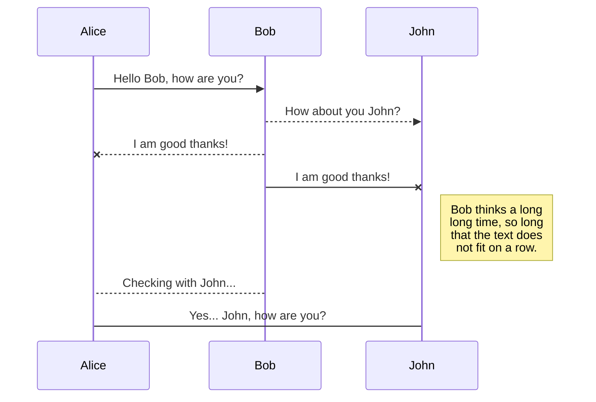

# just the docs 테스트 페이지입니다.
{: .no_toc }


코드
```js
// Javascript code with syntax highlighting.
var fun = function lang(l) {
  dateformat.i18n = require('./lang/' + l)
  return true;
}
```

```shell
//shell
ls -al

```


[Link button](https://just-the-docs.com){: .btn .btn-purple }
[Link button](https://just-the-docs.com){: .btn .btn-blue }
[Link button](https://just-the-docs.com){: .btn .btn-green }

Default label
{: .label }

Blue label
{: .label .label-blue }

Stable
{: .label .label-green }

New release
{: .label .label-purple }

Coming soon
{: .label .label-yellow }

Deprecated
{: .label .label-red }


| head1        | head two          | three |
|:-------------|:------------------|:------|
| ok           | good swedish fish | nice  |
| out of stock | good and plenty   | nice  |
| ok           | good `oreos`      | hmm   |
| ok           | good `zoute` drop | yumm  |


콜아웃 기능은 현재 미구현
{: .highlight }
A paragraph
{: .warning }
A paragraph
{: .note }
A paragraph
{: .important }
A paragraph
{: .new }
A paragraph
{: .important }
> {: .opaque }
> <div markdown="block">
> {: .warning }
> A paragraph
> </div>
>

#머메이드 테스트


test Page tests
{: .fs-6 .fw-300 }
